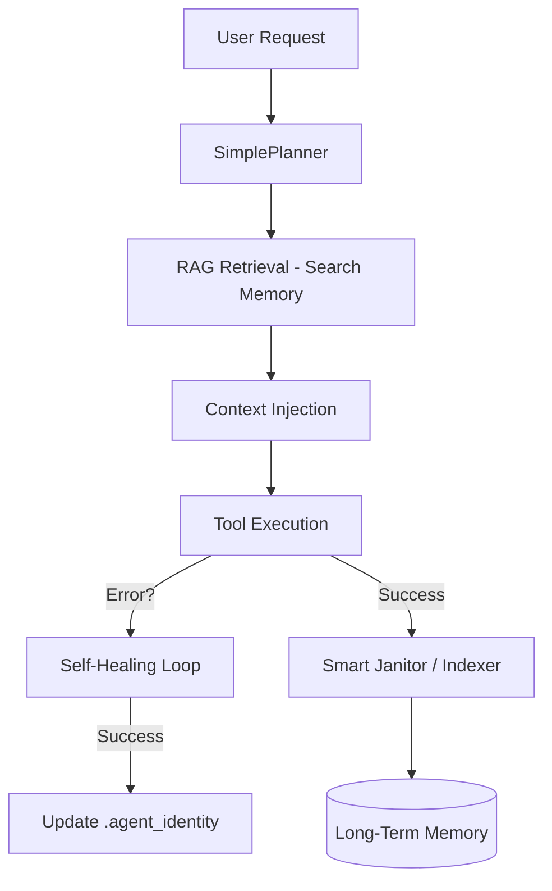

# Arsitektur Unified MCP (Senior Architect Edition)

Dokumentasi arsitektur ini menjelaskan struktur dan aliran kerja sistem MCP yang telah dikonsolidasikan dan profesional.

## 📌 Filosofi Desain
1. **Unification**: Menghilangkan fragmentasi dengan menyatukan semua layanan (LTM, File, Shell) ke dalam satu core Python.
2. **Intelligence-First**: Memberikan kemampuan untuk belajar secara otonom melalui RAG (Retrieval-Augmented Generation).
3. **Infrastructure as Code**: Konfigurasi dan kredensial dikelola secara sistematis melalui folder `config/`.

## 🏗️ Komponen Utama

### 1. Unified Core (`mcp_unified/`)
Infrastruktur utama yang mengekspos tools ke agent.
- **Entry Point**: `core/server.py`
- **Modular Tools**: Terbagi menjadi kategori `execution/` (aksi nyata) dan `intelligence/` (proses berpikir).

### 2. Cognitive Layer (`mcp_unified/intelligence/`)
Otak dari sistem yang menjaga kesehatan dan pengetahuan codebase.
- **Planner**: Mendekomposisi request user menjadi langkah-langkah teknis.
- **Indexer & RAG**: Melakukan *Semantic Chunking* pada dokumen dan kode untuk disisipkan ke dalam context window LLM.
- **Self-Healing**: Mekanisme deteksi error dan perbaikan otomatis berbasis SOP.

### 3. Memory Vault (`mcp_unified/memory/`)
Penyimpanan permanen berbasis vektor.
- **Search**: Hybrid Search (Cosine Similarity + Indonesian FTS).
- **Storage**: PostgreSQL dengan ekstensi `pgvector`.
- **Embeddings**: Lokal via Ollama (`nomic-embed-text`).

## 📁 Struktur Folder Profesional

```text
/home/aseps/MCP/
├── mcp_unified/             # Single Source of Truth Server
│   ├── core/                # Core MCP logic
│   ├── execution/           # Alat eksekusi (Vision, Shell, File)
│   ├── intelligence/        # Indexer, Planner, Self-healing, Janitor
│   └── memory/              # Interface PostgreSQL + Vector
├── config/                  # Pusat Konfigurasi
│   ├── credentials/         # Kunci API & OAuth2 (Restricted 700)
│   └── app-config.json      # Parameter sistem
├── docs/                    # Dokumentasi & Standar Senior Architect
├── data/                    # DB lokal, Cache, dan Input/Output
├── scripts/                 # Maintenance & Test utilities
└── .agent_identity          # Identitas permanen & SOP Agent
```

## 🔄 Alur Kerja Kecerdasan (Intelligence Flow)



## 🛡️ Standar Keamanan & Perawatan
- **Credential Isolation**: Tidak ada kunci API di dalam codebase. Semua diarahkan ke `config/credentials/`.
- **Knowledge Gardening**: Janitor melakukan sinkronisasi pengetahuan codebase setiap kali dijalankan.
- **Atomic Operations**: File operations menggunakan bridge Rust untuk menjamin integritas data (Looming feature).

---
*Status: Arsitektur Solid & Terkordinasi | Pembaruan Terakhir: 2026-02-22*
