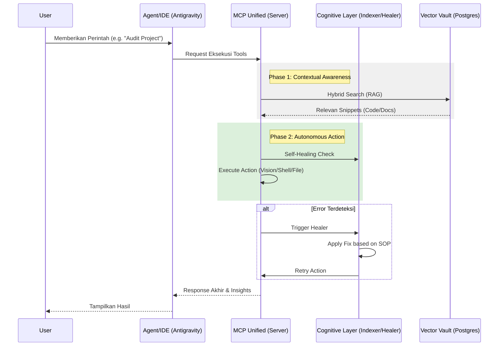

# System Workflow (Senior Architect Edition)

Dokumen ini menjelaskan alur kerja operasional dalam ekosistem MCP yang telah terpadu.

## 1. Alur Interaksi Global

Sistem beroperasi sebagai satu kesatuan di bawah `mcp_unified`, bertindak sebagai jembatan antara User/IDE dan kapabilitas otonom.

## 2. Alur Kerja Intelligence (Senior Architect Operations)

### A. Knowledge Synchronization (Indexer Loop)
Terjadi secara berkala via Janitor atau saat ada request indexing manual.
1.  **File Scan**: Indexer menelusuri `mcp_unified/`, `docs/`, dan `scripts/`.
2.  **Semantic Chunking**: 
    -   Markdown dipotong per-header.
    -   Python dipotong per-class/function.
3.  **Context Mapping**: Setiap chunk diberikan metadata `source`, `hash`, dan `part_index`.
4.  **Vector Store**: Disimpan ke PostgreSQL (`pgvector`) untuk pencarian masa depan.

### B. Self-Healing & Learning Loop
Mekanisme pertahanan diri agent.
1.  **Failure Detection**: Menangkap error seperti `ModuleNotFoundError` atau `ConnectionError`.
2.  **Autonomous Fix**: 
    -   Instalasi library via pip otomatis.
    -   Penanganan path yang salah.
3.  **Insight Recording**: Jika perbaikan berhasil, detailnya dicatat secara permanen ke `.agent_identity`.
4.  **Policy Update**: Agent memperbarui cara kerjanya sendiri (SOP) berdasarkan pengalaman tersebut.

## 3. Alur Kerja Keamanan (Security Sandbox)

1.  **Isolation**: Kredensial dipisahkan ke `config/credentials/`.
2.  **Permission Guard**: Sistem melakukan audit otomatis pada izin file (CHMOD) saat inisialisasi.
3.  **Env Mapping**: Seluruh akses kunci API melalui layer `.env` untuk mencegah kebocoran pada log atau audit trail.

---
*Status: Operasional & Otonom | Pembaruan Terakhir: 2026-02-22*